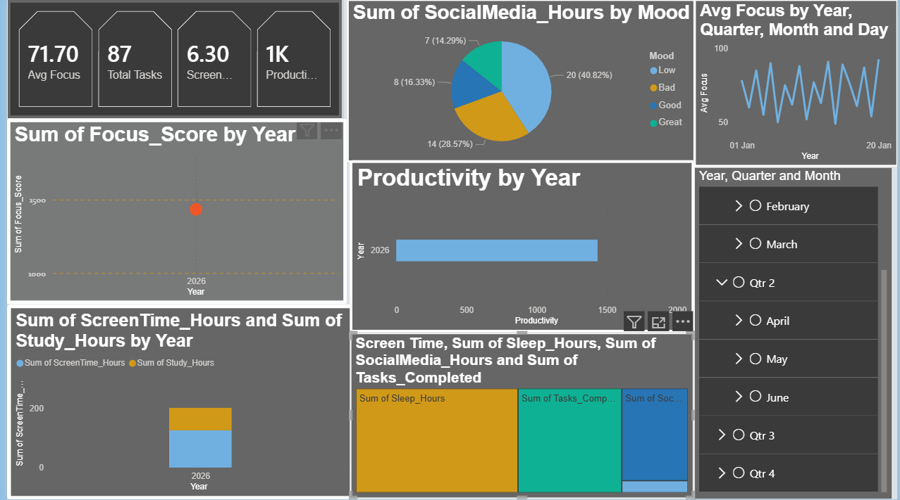
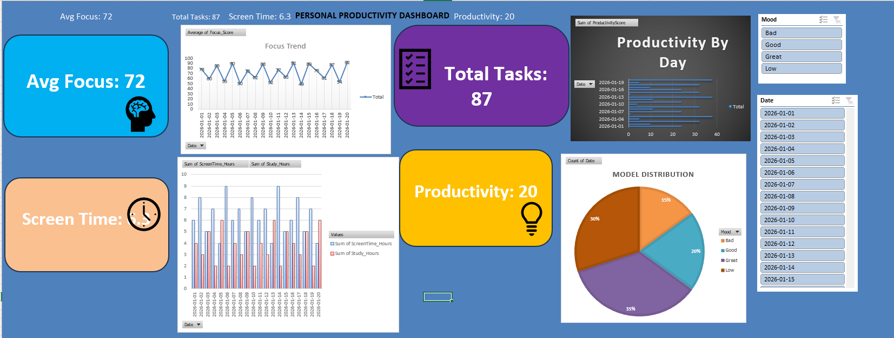

📊 Personal Productivity Analytics Dashboard

An interactive Power BI dashboard designed to analyze daily productivity patterns such as focus score, tasks completed, screen time, mood, and overall productivity.
This project demonstrates data visualization, KPI tracking, and interactive reporting using Power BI.

🚀 Project Overview

This dashboard helps visualize productivity trends and behavioral patterns using interactive charts and filters. It allows users to monitor performance and identify areas for improvement through data-driven insights.

🛠 Tools & Technologies

Power BI
Microsoft Excel
Data Visualization
KPI Metrics
Slicers & Filters

📂 Dataset Features

The dataset includes:

Date
Focus Score
Screen Time Hours
Study Hours
Tasks Completed
Mood
Productivity Score

📈 Dashboard Features

KPI cards for focus, tasks, screen time, and productivity
Trend analysis charts
Mood distribution visualization
Screen vs study comparison
Interactive slicers (date, mood, etc.)
Dynamic filtering and insights

🎯 Key Insights

Tracks productivity trends over time
Identifies correlation between screen time and productivity
Analyzes mood impact on focus levels
Helps understand daily performance patterns

🖼 Dashboard Preview

